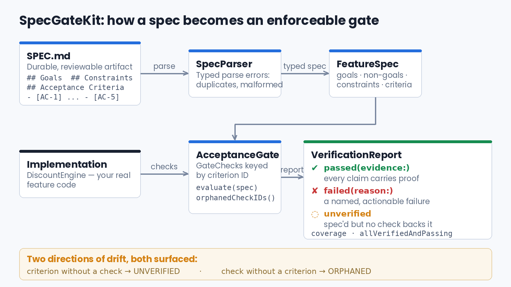

# SpecGateKit — spec-driven development, made executable

A small Swift library (plus a runnable SwiftUI demo app) that treats a feature
spec as an **executable artifact** instead of documentation: parse it, bind its
acceptance criteria to real checks against your implementation, and get a
verification report that names what is proven, what failed, and what is merely
hoped for.

Companion demo for the article: [**The Spec Is the New Unit of Work: Spec-Driven
Development for Teams Running AI Agents**](https://medium.com/@er.rajatlakhina/the-spec-is-the-new-unit-of-work-spec-driven-development-for-teams-running-ai-agents-015f15f9bf0e).



## What it shows

- **`SpecParser`** — parses a lightweight Markdown spec format (`## Goals`,
  `## Non-Goals`, `## Constraints`, `## Acceptance Criteria` with stable
  `[AC-n]` IDs) into a typed `FeatureSpec`. Duplicate criterion IDs are a parse
  *error*, not a warning. Unknown sections are ignored on purpose, so the
  format can grow without breaking older tooling.
- **`AcceptanceGate`** — binds each criterion ID to an executable `GateCheck`
  against the real implementation. Evaluation returns one of three states per
  criterion:
  - `passed(evidence:)` — every success carries what was actually observed;
  - `failed(reason:)` — a named, actionable failure (thrown errors are
    captured as failures, never swallowed);
  - `unverified` — **the state this library exists to make visible**: the
    criterion is in the spec, but no executable check backs it.
- **Drift in both directions** — criteria without checks come back
  `unverified`; checks without criteria are surfaced via `orphanedCheckIDs`
  (verified behavior nobody specified).
- **`SpecDiff`** — diffs two spec revisions into added / removed / reworded
  criteria, so a change of intent is a reviewable diff, not chat archaeology.
- `allVerifiedAndPassing` is deliberately strict: unverified criteria block
  the green light, and an empty spec never reads as passing.

```swift
var gate = AcceptanceGate()
try gate.register(GateCheck(criterionID: "AC-1") {
    let observed = engine.total(forOrderOf: 100.0)
    guard observed == 90.0 else {
        return .failed(reason: "expected 90.0, got \(String(describing: observed))")
    }
    return .passed(evidence: "100.0 order came back as 90.0")
})

let report = gate.evaluate(spec)
print(report.summaryLine())
// Cart Discount Engine: 4 passed, 0 failed, 1 unverified — coverage 80%
```

## The demo app

`Demo/Demo.xcodeproj` is a SwiftUI app that ships with **its own spec** (a
five-criterion "Cart Discount Engine") and runs the gate live: green/red/orange
badges per criterion, a coverage bar, and an **"Introduce regression"** toggle
that swaps in a buggy discount rate so you can watch `AC-1` flip from passed to
failed in front of you. `AC-5` (locale currency formatting) is deliberately
left without a check so the `unverified` state is always on screen.

## How to run it

1. Clone this repo.
2. Open `Demo/Demo.xcodeproj` in Xcode.
3. Pick any iOS Simulator and **Build & Run**. No other setup — the app
   consumes the library through a local Swift Package reference in the same
   repo.

## Repo layout

```
Package.swift              // library + tests only — no executable target
Sources/SpecGateKit/       // FeatureSpec, SpecParser, AcceptanceGate, SpecDiff
Tests/SpecGateKitTests/    // parser failure modes, gate edge cases, diff determinism
Demo/DemoApp.swift         // @main SwiftUI app (single file)
Demo/Demo.xcodeproj/       // hand-authored project, local package reference
article-assets/            // the article's header, diagram, and code images
```

Deliberately **no** Swift Package `.executableTarget` posing as the app:
running a package directly as an iOS app relies on a per-checkout synthesized
bundle identifier that is never committed to git and reproducibly crashes on
launch. The runnable app is a real `.xcodeproj`.

## Verification status — honest ceiling

This repo was authored in a Linux sandbox as part of an automated pipeline. In
this environment:

- **Not run this session:** `swift build` / `swift test` — the Swift toolchain
  download was unreachable at usable speed from this sandbox (probed twice,
  ~6–23 KB/s against a ~770 MB toolchain). The test suite is written to be run,
  and covers the parser's failure modes (empty/missing sections, duplicate and
  malformed criteria), the gate's edge cases (throwing checks, duplicate
  registration, empty-spec-never-passes, coverage math), and diff determinism.
- **Not run this session:** the demo app on an iOS Simulator, and therefore no
  real screenshots — computer-use access is hard-blocked during unattended
  scheduled runs on this machine (the access request was made and refused at
  the platform level).
- **What was done instead:** scripted brace/paren/bracket balance checks on
  every Swift file and the `project.pbxproj` (all balanced), a scripted
  force-unwrap scan (zero found), XML validation of the shared scheme, and a
  line-by-line manual review against common crash classes.

If you hit a build issue, please open an issue — a genuine compiler error
report is worth more than this README pretending one can't exist.
